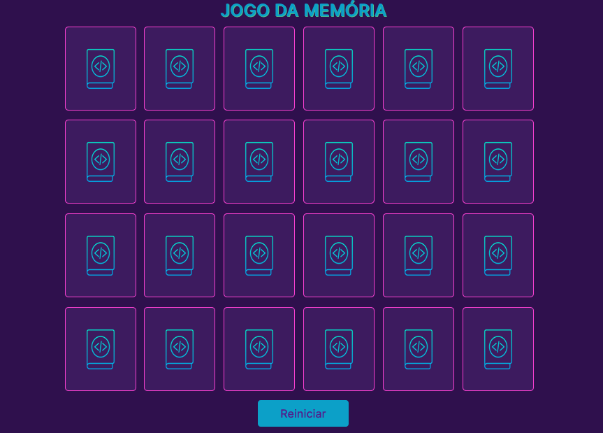

# Jogo da memória 💻

Projeto desenvolvido em um tutorial da freeCodeCamp para praticar javascript.

## ⚙️ Funcionalidades

- Apliquei responsividade, grid, flexbox e animações com javascript e css.
- Cartas com o tema de linguagens de programação.

## 🚀 Deploy

- <a href="https://memorygame-22.netlify.app/" target="_blank">Live</a>

## 🛠️ Tecnologias utilizadas

**Front-end:** 

 - Javascript, 
 - HTML, 
 - CSS

**Ferramentas:** 

- Visual Studio Code,
- Git

## 🦸 Autores

- <a href="https://www.linkedin.com/in/levy-matias/" target="_blank">Levy Matias</a>
  
---
